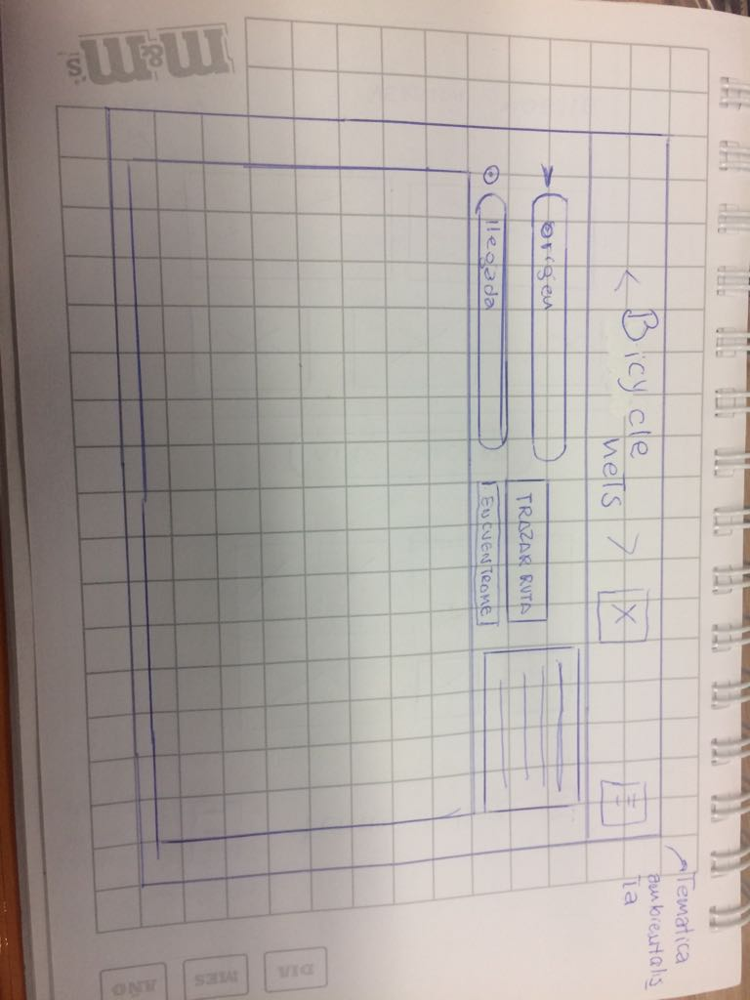

# BYCICLE NETS

* **Track:** _Common Core_
* **Curso:** _Construye una single page app (SPA) multiusuario consumiendo data remota_
* **Unidad:** _¿Qué hay de nuevo en HTLM5?_

***

## Introducción :
Este proyecto consiste en implementar una página que traze la ruta de un lugar _"A"_ hacia un lugar _"B"_  en la que además el usuario tenga la posibilidad de encontrar su ubicación ; estos requerimientos deberán ser resueltos haciendo uso del _API Geolocation_ .
## PLAN DE TRABAJO : 
El proyecto se realizó en un día y para ello se propuso dividir el proyecto en una serie de etapas que se detallarán a continuación :

#### ETAPA 1 : 
* Dibujar el sketch del proyecto ( imagen adjunta al final de esta etapa).
* Elección de colores y tipografías.
* Elección del nombre del proyecto ("Bycicle Nets")
* Crear issues y milestones que sirvan como hoja de ruta (roadmap).

#### ETAPA 2 :

* Inicializar proyecto con `npm init` y `git init`.
* Agregar transpilador BABEL .
* Añadiendo frameworks necesarios 
* Obteniendo clave del API.
* Inicializando mapa.
* Primera versión README.

### ETAPA 3 :
* Maquetación.
* Primera parte de la funcionalidad (Boton para saber la localizacion del usuario)
* Añadiendo marcador / Geolocalización.

### ETAPA 4 :

* Segunda Parte funcionalidad (Autocompletado);
* Tercera parte Funcionalidad (Trazado de rutas);
* Publicación de la página en gh-pages.
* Versión final README.

## Archivos importantes

El proyecto presenta los siguientes archivos para uso del usuario:

* `README.md` con descripción del proyecto, imagenes del mismo y organización del equipo.
* `index.html`: Página principal del proyecto.
* `index.css`: Archivo css que contiene los estilos del proyecto.
* `src/index.js`: Contiene toda la funcionalidad del proyecto (ES6).
* `package.json` con nombre, versión, descripción, autores, licencia, dependencias, scripts.

## Imagenes del proyecto :

## Demo
Para ver el demo dar click [aquí](https://manu160296.github.io/cardify/public/index.html "titulo").

## Autoras

* Rocci Escobar Nuñez [Cuenta GitHub](https://github.com/Rocciescobar "titulo")
* Manuela Flores Vilchez [Cuenta GitHub ](https://github.com/Manu160296 "titulo")

